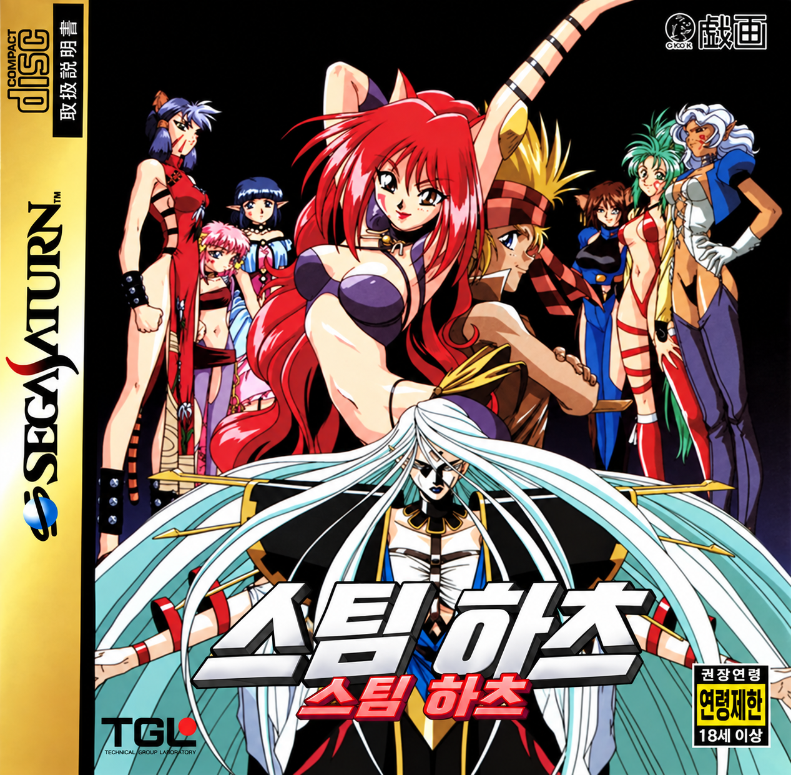
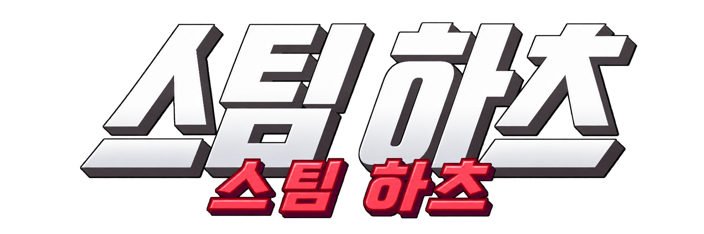

<p align="center"></p>

# 스팀 하츠 (STEAM-HEART'S) 세가새턴판 한글 패치

<p align="center"></p>

## 게임 소개

**스팀 하츠**(スチーム・ハーツ, STEAM-HEART'S)는 TGL/戯画(기가)가 만든 종스크롤 슈팅 게임입니다. PC-98·PC 엔진판을 거쳐 1998년에 세가새턴으로 이식되었고, 이 저장소가 다루는 것은 **세가새턴 일본판**(품번 T-32502G, V1.001)입니다.

- **장르**: 종스크롤 슈팅. 스테이지를 깨면 비주얼 장면(그림 + 음성)이 나옵니다.
- **대화**: 스테이지 안 대화와 비주얼 장면은 얼굴 그림·일러스트와 **음성만** 나오고 글자 창이 없습니다.
- **등급**: 원판은 18세 이상 이용가입니다.

## 이 저장소

이 게임의 한글화 도구와 번역 데이터를 두는 곳입니다. **원본 디스크 이미지는 들어 있지 않고, 앞으로도 커밋하지 않습니다.** 사용자가 가진 원본 디스크에서 한글판 디스크 이미지를 만들어 내는 방식입니다.

지원 원본: 1번 트랙(데이터) 97,008섹터, SHA-1 `71cc4fc3e0613cc76c99392a2fa66cfa18fb05ef`. CHD(`Steam-Hearts (Japan).chd`)를 `chdman extractcd`로 푼 BIN/CUE와 Redump식 트랙별 BIN/CUE를 모두 받습니다. 트랙 해시가 다르면 빌드가 거부합니다.

## 현재 상태

**v0.1 개발판** — 화면에 나오는 일본어 그림 글자를 전부 한글로 바꾸고 실행 확인까지 했습니다. 번역 검수가 끝나지 않아 빌드 결과는 `distribution: false`입니다.

| 대상 | 내용 | 상태 |
|---|---|---|
| 타이틀 로고 (`SHLOGO.SPT`) | 제공된 `title_ko.png`를 원래 로고 자리에 16색 스프라이트로 넣음 | 실행 확인, **로고 승인 대기** |
| 백업 RAM 안내 7장 (`*.SA`) | 용량 부족·초기화 안 됨·기록 손상·데이터 선택·읽는 중·예/아니요·본체/카트리지 RAM | 5장 실행 확인(화소 단위 일치), 데이터 선택·카트리지 줄은 코드로만 확인 |
| 엔딩 스태프 롤 (`SR.SPT`) | 18블록, 역할·회사명 번역, 이름 한글 음역 | 실행 확인, **이름 독음 일부 확인 필요** |
| 오프닝 동영상 속 로고 | Cinepak 동영상 안의 그림 | 1차에서는 그대로 둠 (결정 D-2) |
| 메뉴·옵션 | 원판도 영어 | 그대로 둠 |
| 음성 | 자막 없음 | 넣지 않음 (결정 D-5) |

자세한 조사·확인 기록은 [`docs/initial-survey.md`](docs/initial-survey.md)에 있습니다.

### 남은 일

1. 번역 2차 검수와 사람 검수 (`translation/*.json`의 `status`를 `distribution_eligible`로).
2. 스태프 롤 이름 중 독음이 확실하지 않은 것 확인 (`credits.json`의 `reading_uncertain`: 吉田 圭良, 堀 善宜, 福島 瑞生, 東 孝, 吉川 元庸, 村松 英孝, 須山 秀治, 石立 勉, 里内 知).
3. 타이틀 로고 승인 (`assets/title/layout.json`의 `approved`).
4. 데이터 선택 화면(`SIYO.SA`, `RAM.SA`)과 카트리지 읽는 중 줄의 실제 표시 확인.
5. 스테이지 지도(`.MAX`) 안에 그림 글자가 없는지 남은 스테이지 확인.

## 번역 데이터

| 파일 | 내용 |
|---|---|
| [`translation/sa.json`](translation/sa.json) | 백업 RAM 안내 17칸 (원문 받아쓰기·번역·상태) |
| [`translation/credits.json`](translation/credits.json) | 스태프 롤 18블록 |
| [`assets/sa/layout.json`](assets/sa/layout.json) | 안내 그림별 글자 상자·위치·색 |
| [`assets/title/layout.json`](assets/title/layout.json) | 타이틀 로고 크기·위치·색 수·승인 여부 |

번역문의 `\n`은 줄바꿈입니다. 상태는 `needs_review` → `needs_human_review` → `distribution_eligible` 순서로 올라갑니다.

## 준비물

- Python 3.11 이상, Pillow 9.4 이상, NumPy, fontTools, pytest (테스트용)
- Noto Sans CJK KR Medium (`/usr/share/fonts/opentype/noto/NotoSansCJK-Medium.ttc`, 데비안 `fonts-noto-cjk`)
- 원본 디스크 BIN/CUE (CHD라면 `chdman extractcd -i "Steam-Hearts (Japan).chd" -o "Steam-Hearts (Japan).cue"`)
- 실행 확인용: Mednafen 1.29 이상, 세가새턴 BIOS `sega_101.bin`(프로젝트 폴더, 커밋하지 않음)

## 사용법

```sh
# 한글판 만들기 → out/ko/ 에 BIN/CUE와 manifest.json
python3 tools/khpatch.py build --source "/경로/Steam-Hearts (Japan).cue"

# 대조군: 아무것도 바꾸지 않은 빌드 (원본과 바이트 단위로 같아야 함)
python3 tools/khpatch.py build --source "/경로/Steam-Hearts (Japan).cue" --out out/control \
    --sa original --title original --credits original

# 테스트
python3 -m pytest -q tests

# 실행 (Mednafen)
./run_ko.sh
```

빌드는 원본 트랙 해시를 확인한 뒤 바꿀 파일을 원래 섹터 안에 다시 넣습니다. 파일이 원래 바이트 크기보다 커지면 같은 섹터 수 안에서만 ISO 9660 크기를 고치고, 섹터를 넘으면 실패합니다. 모든 섹터 변경은 쓰기 계획(원본 기대값 확인·겹침 거부·최종 차이 감사)으로 한 번에 적용하고, 섹터 EDC/ECC를 다시 계산합니다. 글꼴에 없는 글자, 글자 상자를 넘는 줄, 원래 VRAM 사용량이나 작업 버퍼를 넘는 스프라이트도 빌드를 멈춥니다.

## 한글화 방향

- **범위**: 화면에 그림으로 박힌 일본어를 모두 한글로 바꿉니다. 영어 메뉴와 회사 로고(戯画, GIGA)는 원판대로 둡니다.
- **로고**: 제공 로고를 원래 로고 자리(폭 약 500, 화면 y 72–160)에 맞춰 넣었습니다(결정 D-1).
- **스태프 롤**: 역할과 회사명은 번역하고 사람 이름은 일본어 발음대로 적습니다. 표기는 같은 팀의 스치파이2 한글판 관례(츠, 거센소리 첫소리: 키무라 타카히로)를 따릅니다. 회사명 戯画는 "기가"로 적습니다.
- **용어**: セーブ → 저장, 本体 → 본체, カートリッジRAM → 카트리지 RAM, 保存データ管理画面 → 저장 데이터 관리 화면.
- **모양**: 안내 화면은 원본처럼 기울인 고딕에 16단계 안티앨리어싱, 스태프 롤은 원본 회색 단계를 씁니다(디스크 공간 때문에 가장 어두운 단계 하나는 뺌).

## 기술 메모

- 압축: 3바이트 크기 + 창 종류(0 = 4096바이트, 1 = 1024바이트) + Okumura LZSS. 게임 해제 루틴(`0.BIN 0x0601068C`, `MAIN.BIN` 두 곳)을 역어셈블해 지우지 않는 링 꼬리와 끝내는 조건까지 맞췄습니다.
- 그림 형식: `.SA`(RGB555 + CR LF), `.PXT`("GIGA32K", 아래 줄부터), `.SPT`(16색 스프라이트 묶음, 프레임마다 압축 블록).
- 확인: Mednafen 세이브 스테이트에서 VDP1/VDP2 VRAM을 꺼내 빌드 결과와 화소·바이트 단위로 대조했습니다. 엔딩은 확인 전용 시험 디스크(제품과 분리)로 재생했습니다.

## 버전

| 버전 | 의미 |
|---|---|
| v1.0 | 정식판. 모든 번역이 사람 검수를 통과하고 로고가 승인된 첫 버전 |
| **v0.1** | 개발판. 그림 글자 전부 교체·실행 확인, 검수 전 |

## 권리

- 이 저장소에는 원본 디스크 이미지나 원본에서 뽑아낸 그래픽·음성 덤프를 넣지 않습니다. 원작 게임의 권리는 TGL/戯画와 각 권리자에게 있습니다. 합법적으로 가진 원본에만 적용하세요.
- Noto Sans CJK는 SIL Open Font License입니다(저장소에 포함하지 않고 시스템 글꼴을 사용).
- 번역 표의 `ja` 필드에는 그림 글자에서 옮겨 적은 원문 문자열이 들어 있습니다(재삽입·검수에 필요).
- `cover_ko.png`(한글판 표지)와 `title_ko.png`(한글 로고)는 프로젝트 소유자가 제공한 이미지로, 원작 표지 그림과 로고 디자인을 바탕으로 합니다.
